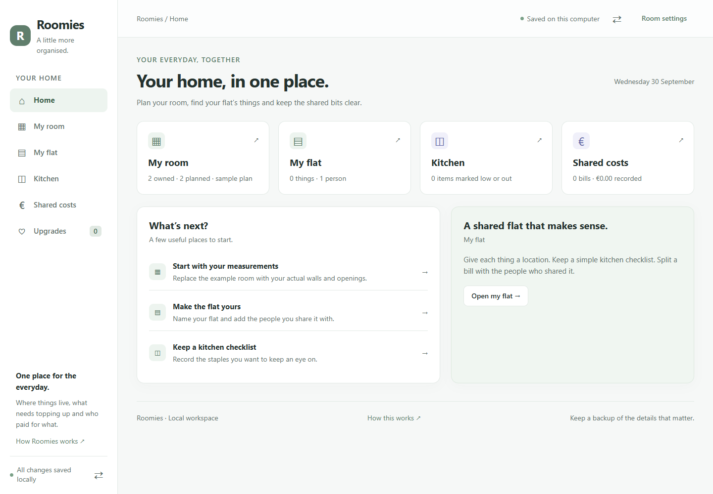

# Roomies

**Your room, your flat, and the things you share.**

I wanted one place to plan my room, find the things I own, keep track of kitchen supplies, and split flat expenses. Roomies brings these everyday tasks together, with a simple home screen and a separate page for each job.



## Start here

Requires Python 3.10 or newer. The application uses Python's standard library. It needs no API key, paid service or database server.

```sh
git clone https://github.com/satyamtomar524-tech/roomies.git
cd roomies
python -m roommate
```

The Python module remains `roommate` so existing working copies and databases keep working. The installed package also provides a `roomies` command. On Windows, run `py -m roommate` or:

```powershell
.\start.ps1
```

Open the local address printed in the terminal. Leave the terminal open while using Roomies; Ctrl+C stops it. For planning and manual records without scheduled price checks, use `python -m roommate --no-tracker`.

## One page for each job

| Page | What I use it for |
|---|---|
| Home | See the next useful action and open the right part of the app |
| My room | Arrange measured furniture, reserve future spaces, preview colours and check conflicts |
| My flat | List belongings, their owner, room and exact storage spot; search for an item |
| Kitchen | Find kitchen equipment and check fridge, freezer and pantry supplies |
| Shared costs | Record who paid, select who shares the bill and see balances |
| Upgrades | Keep a wishlist and dated price observations linked to reserved room spaces |

The room starts as a clearly labeled **3 × 3.5 m sample**. The flat starts empty with a placeholder member named Me. No possessions, groceries, purchases or debts are invented.

## The useful details

A belonging can be saved as “Kettle → Kitchen → Worktop beside the sink,” with an owner or Shared. These records do not need furniture dimensions. A measured bed on the room plan and a belonging in the flat list are separate records.

The kitchen list records what is stocked, running low or missing. Low and missing items form a shopping checklist. Optional best-before dates help decide what to check next; they are the user's records, not food-safety assessments.

Expenses use integer cents. A €20.00 bill split three ways becomes €6.67, €6.67 and €6.66 in the saved participant order. Balances and suggested payments reconcile every cent. Suggestions do not send money or track bank transfers.

Room planning keeps the existing boundary, overlap, surface-parent and clearance checks. Advanced settings are available when needed. A lamp can belong to a desk surface; a rug can overlap furniture.

## Price tracking

Live checks read public [Product](https://schema.org/Product) and [Offer](https://schema.org/Offer) JSON-LD on compatible pages. They require an unambiguous current EUR offer and permitted crawling. Unsupported pages fail visibly and can be recorded manually.

Automatic variant confidence requires a confirmed saved variant, matching retailer SKU and matching product link. The adapter leaves shipping unknown. An item-price drop is labeled separately from a confirmed delivered-price target alert.

Checks run only while the local server is open. No real retailer has been demonstrated as compatible in this build. The app does not claim market-wide search, actual savings, automatic checkout or cloud notifications.

## Understand the project

Start with [Project guide](docs/PROJECT_GUIDE.md), then follow one action through [Architecture](docs/ARCHITECTURE.md). [Data and rules](docs/DATA_AND_RULES.md) explains fit, dates and money. [Verification](docs/VERIFICATION.md) records the checks. [Portfolio notes](docs/PORTFOLIO.md) gives a factual CV and interview description.

An abbreviated guide is also available inside the app.

```sh
python -m unittest discover -s tests -v
node --check web/app.js
node --check web/flat.js
```

Optional browser checks and the [GitHub workflow runs](https://github.com/satyamtomar524-tech/roomies/actions) cover the full workflow.

## Data and scope

Roomies is a local, single-user workspace. Member names are bookkeeping labels, not accounts or invitations. Roommates do not have live access from their own phones. Runtime databases are excluded from Git. Backups can contain room measurements, belongings and expense records; keep actual flat backups private.

Current backups include the room, products, history and flat. Older room-only backups leave the flat unchanged. Importing a current backup replaces those saved records after confirmation. Imports do not replay old price alerts.

The floor plan uses rectangular footprints and modeled clearance zones, not a detailed survey or photorealistic 3D view. Suggestions are heuristic options. Colours are schematic previews. The budget is a recorded preference, not an affordability assessment.

I used coding assistance to implement this project. The idea and requirements came from me. The code, tests and guide stay together so I can inspect the choices and learn the implementation.

## References

[EricAndrechek/Room-Planner](https://github.com/EricAndrechek/Room-Planner) and [sonoyumi/price-tracker](https://github.com/sonoyumi/price-tracker) were reviewed as feature references for the original room-and-price workflow. No source code from those repositories was copied.

MIT license · Satyam Tomar
