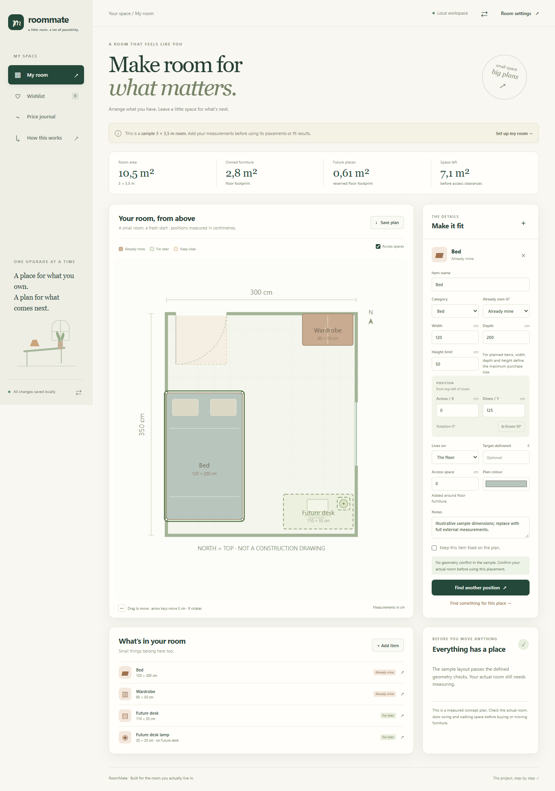

# RoomMate

**A small room can work better when every thing has a place.**

I wanted a room planner that remembers what I already own, keeps space for the things I want later, and helps me decide whether a product actually fits my plan and budget. RoomMate puts that room map and shopping journal together.

The starting room is an illustrative **3 × 3.5 m** student room. It is not a measured copy of my room. Furniture dimensions and any example prices are labeled sample data.



## Start here

Requires Python 3.10 or newer. The application uses Python's standard library and does not require an API key or a paid service.

```sh
git clone https://github.com/satyamtomar524-tech/roommate.git
cd roommate
```

Or download and extract the source ZIP, then open a terminal in its folder.

```sh
python -m roommate
```

Open the local address printed in the terminal. On Windows, `py -m roommate` also works if the Python launcher is installed. `start.ps1` finds either an installed Python or the bundled Codex runtime.

```powershell
.\start.ps1
```

Run from this repository directory. Leave the terminal open while using RoomMate. Ctrl+C stops it. Check `python -m roommate --help` for server options.

For room planning and manual price records without scheduled network requests, use `python -m roommate --no-tracker`.

## What I can do with it

- Enter room and furniture measurements in centimeters.
- Preview room colours and give each item its own plan colour.
- Arrange owned furniture and mark space for planned purchases.
- Check room boundaries, furniture overlaps, reserved spaces, and modeled door clearance.
- Keep a lamp on a desk as a supported item, or a rug as an overlay instead of treating every object as floor furniture.
- Compare suggested positions using explained placement rules.
- Connect a wishlist product to its reserved space.
- Record a product's dimensions, selected variant, availability, item price, and shipping.
- Keep dated price observations in SQLite and view the price journal.
- Check supported public product pages for an unambiguous EUR offer.
- Receive an in-app alert when a verified product fits its reserved space and reaches the delivered-price target.
- See a lower item price separately when delivery still needs confirmation.
- Export room and shopping data, import a saved project, or export a price CSV.

## The decision RoomMate supports

```text
Measured room → owned things → reserved spaces → suitable products → price observations
```

A price below the target is only part of the decision. Product dimensions, the reserved place, selected variant, stock, shipping, and observation freshness also matter. Missing information stays visible; RoomMate does not fill it in.

## Read the project in order

1. [Project guide](docs/PROJECT_GUIDE.md): what each part does and how to use it.
2. [Architecture](docs/ARCHITECTURE.md): where the behavior lives and how data moves.
3. [Data and rules](docs/DATA_AND_RULES.md): measurements, fit checks, price handling, and limitations.
4. [Verification](docs/VERIFICATION.md): tests run and remaining limitations.
5. [Build journal](docs/BUILD_JOURNAL.md): decisions and the next useful improvements.

An abbreviated guide is available inside the app.

## Check the project

```sh
python -m unittest discover -s tests -v
node --check web/app.js
```

Browser checks are described in the verification document. GitHub Actions includes the Python suite, JavaScript syntax and a Chromium workflow. See the [actual workflow runs](https://github.com/satyamtomar524-tech/roommate/actions) for their current state.

## Price tracking scope

Live checks use public [Product](https://schema.org/Product) and [Offer](https://schema.org/Offer) JSON-LD data when the page is readable, crawling is allowed, and one current EUR offer can be identified. JavaScript-only pages, blocked requests, ambiguous variants, and unsupported currencies produce a visible failure rather than a guessed price. You can record a checked offer manually.

For live price-drop notices, confirm the saved variant and enter its retailer SKU. The fetched SKU and saved product link must match. The live adapter leaves shipping unknown, so these notices are not delivered-price recommendations. A checked manual observation can include delivery and confirm the variant for that quote.

Checks run locally while the server is running. There is no cloud monitoring, checkout automation, email delivery, or guarantee of coverage across retailers. A retailer's displayed discount is not taken as proof of savings. The journal records observed prices with their sources and dates.

## Measurements and limitations

RoomMate is for planning where things might go. It uses rectangular footprints and defined clearance zones, not a detailed 3D survey. A measured fit is only as accurate as the dimensions entered. Door clearance is conservative; personal comfort, access, wiring, radiator clearance, load capacity, fire escape, and building rules need separate attention. Suggested positions are heuristic options, not a globally optimal or certified layout.

## Local data

Room and shopping records stay in a local SQLite database. Runtime databases are excluded from Git. Exported backups may contain room measurements and product links: keep them private when they describe your actual room. Live checks send a request to the product site's public page; they do not use your browser account or cookies.

## Portfolio use

The project can demonstrate Python, SQL, HTTP APIs, geometric validation, price-history handling, automated testing, and interface design. Describe the parts you can explain and have checked. See [Portfolio notes](docs/PORTFOLIO.md) for a factual project description and a short interview walkthrough. Do not claim real users, measured savings, market-wide coverage, or autonomous architectural design.

I used coding assistance to implement this project. The room-planning idea and requirements came from me. The code and guide are kept together so I can inspect each decision and learn the implementation as I develop it further.

## References

The project idea combines room planning and a price journal. [EricAndrechek/Room-Planner](https://github.com/EricAndrechek/Room-Planner) and [sonoyumi/price-tracker](https://github.com/sonoyumi/price-tracker) were reviewed as feature references. This project is an original implementation; no source code from those repositories was copied.

MIT license · Satyam Tomar
