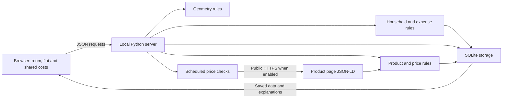

# How the project is put together

Roomies has a room plan and a separate flat base. The browser draws the room and collects household inputs. Python validates the inputs, applies the planning and expense rules, and stores the records in SQLite. There are two transports: the original localhost HTTP server and a device-local public browser build using Pyodide. [Browser hosting](BROWSER_HOSTING.md) explains the second path.



## File responsibilities

| File | Responsibility |
|---|---|
| `roommate/geometry.py` | Room validation, rectangular footprints, overlap and boundary checks, room-area accounting, candidate positions |
| `roommate/household.py` | Flat members, belongings, kitchen stock, ownership references and summary validation |
| `roommate/expenses.py` | Exact-cent bills and repayments, monthly templates, participant shares and balances |
| `roommate/pricing.py` | Product/observation validation, fit and target evaluation, structured-offer parsing, restricted public HTTP fetching |
| `roommate/storage.py` | SQLite schema, transactions, room and product records, price history, deduplicated notifications, import/export |
| `roommate/server.py` | HTTP routes, request limits, localhost access checks, static files, scheduled checks |
| `roommate/browser.py` | Browser action dispatch using the same validation and storage, without retailer network calls |
| `web/browser.js` / `browser-worker.mjs` | Worker transport, one-tab protection, Pyodide and durable browser saves |
| `scripts/build_browser.py` | Pinned runtime verification and an allowlisted, private-data-free static build |
| `roommate/tracker.py` | Opted-in checks, per-product due times, bounded cycles, clean worker shutdown |
| `web/index.html` | Accessible controls and page structure |
| `web/app.js` | Selection, drawing, dragging, editing, API requests, journal rendering, export/import controls |
| `web/flat.js` | Home, flat inventory, kitchen lists, member settings and shared-cost controls |
| `web/costs.js` | Repayment forms, monthly bill templates and reviewed bill entry |
| `web/style.css` | Responsive application layout and appearance |
| `web/guide.html` | Short guide inside the app |
| `tests/` | Behavioral checks and regressions |

## Flows to follow

### Save a belonging or kitchen record

1. The browser collects a name, owner and location or stock details.
2. It sends the complete flat to `PUT /api/flat`, separately from the room save route.
3. `household.py` validates fields, limits and references to current members.
4. Storage saves the normalized flat in one transaction; the server returns it with its summary.

Adding a pan does not change room geometry. A flat record and a measured room item are separate records.

### Split an expense

1. The browser converts the entered EUR amount to integer cents and sends it with the payer and participant IDs.
2. Validation rejects missing members, duplicate participants and malformed amounts.
3. `expenses.py` divides cents evenly, giving remainder cents to the first participants in saved order.
4. Each balance equals bills paid minus allocated shares, plus repayments sent and minus repayments received. The sum of balances is zero.
5. The module matches debtors to creditors to suggest reconciling payments. This is a deterministic greedy calculation, not proof of a globally minimal set of transfers.

Suggestions do not move money. A separate repayment record stores a transfer the user says has already happened; it is not bank verification. Member IDs keep references stable when names change.

### Reuse a monthly bill

1. Save the usual amount, payer, participants and due day in `monthly_bills`.
2. The summary calculates this month's due date, using the month's last day when necessary.
3. The user opens a draft and checks its amount and payment date before saving it as an expense.
4. The expense keeps `bill_id` and `bill_month`. Validation rejects a duplicate pair and requires the month to match its date.

Templates never create expenses on a timer. Editing or deleting a template leaves recorded expenses intact. The `bill_id` on an old expense is provenance, so it remains valid after its template is removed.

### Move an item

1. Select the item in the browser and drag it or edit X/Y.
2. The browser sends the complete room to the room API.
3. The server validates the schema. Malformed dimensions are rejected.
4. The geometric analysis identifies placement problems. A conflicting arrangement can remain saved so the user can see and fix it.
5. The room is saved in one SQLite transaction and returned with its analysis.

The server is the source of saved state. The interface reports a failed save instead of presenting it as completed.

### Record a price

1. Choose a product and enter a dated observation.
2. The server validates the price, currency, timestamp, stock, shipping, and source.
3. Storage keeps the observation as a separate record linked to that product.
4. Product evaluation uses the relevant reservation and the newest dated observation.
5. If the monitored product meets all eligibility conditions and the condition changed, storage records a target notification. A confirmed lower item price can produce a separately labeled informational notice when delivery remains unknown.

### Check a live product page

1. Use a saved public HTTPS URL and enable monitoring when scheduled checks are wanted.
2. The network helper validates the hostname, DNS addresses, redirects, limits, and crawling permission.
3. It reads a supported page without browser credentials or script execution.
4. The parser accepts one explicit Product with one current EUR Offer.
5. The observation records what was provided. Shipping stays unknown. Live variant confidence requires the saved confirmed SKU, requested URL and current product identity to match; missing evidence stays unconfirmed.
6. An unsupported page produces a stored, visible check error; it does not become a zero-price observation.

## Why these choices

The application is small enough to run with Python's standard library. SQLite gives real transactions and inspectable SQL without setting up a database server. SVG uses the same measurements as the fit rules, so the plan remains tied to the data.

This version has no user-account system or cloud deployment. Local monitoring is a thread in the running server, not an always-on cloud service. Keep the server bound to localhost; the project is not designed to expose its write API publicly.

## Database structure

- `room`: the current room as normalized JSON, one row.
- `flat`: members, belongings, kitchen stock, expenses, repayments and monthly templates as validated JSON, one row, saved separately from the room.
- `products`: stable product identity, source link, dimensions, target, and monitoring settings.
- `observations`: dated quotes linked to a product, with price, shipping, stock, variant evidence, and source.
- `notifications`: typed item-price or target updates, their source observation, time, and read state.

Foreign keys keep observations attached to valid products. Parameterized SQL avoids turning a product name or note into executable SQL. Imports validate the complete incoming workspace before replacing data in a transaction.

Schema 3 backups include all flat lists. Schema 1 room-only backups preserve the current flat. Schema 2 restores the flat data it contains, with empty newer lists when absent; the browser explains this before import. Resetting the sample room preserves flat records. Opening an older database supplies empty new lists without discarding saved data. A write from an older open tab preserves repayments and monthly templates when it omits those fields.

## A small SQL exercise

Open a copy of the database with an SQLite tool. This query lists recorded prices with the product name:

```sql
SELECT
    json_extract(p.data, '$.name') AS product,
    json_extract(o.data, '$.observed_at') AS observed_at,
    json_extract(o.data, '$.price_eur') AS item_price_eur,
    json_extract(o.data, '$.shipping_eur') AS shipping_eur
FROM observations AS o
JOIN products AS p ON p.id = o.product_id
ORDER BY observed_at DESC;
```

NULL shipping means unknown. Do not replace it with zero in a delivered-price report. The CSV export is an easier first step if you want to inspect the data in Excel.
