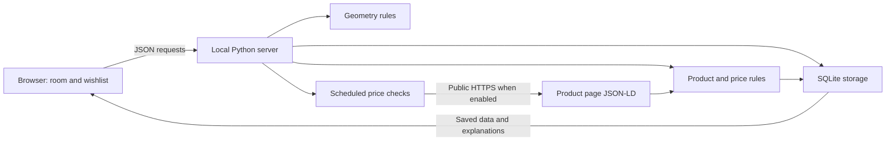

# How the project is put together

RoomMate is one local application. The browser draws the room and collects inputs. Python validates the inputs, applies the planning rules, and stores the records in SQLite.



## File responsibilities

| File | Responsibility |
|---|---|
| `roommate/geometry.py` | Room validation, rectangular footprints, overlap and boundary checks, room-area accounting, candidate positions |
| `roommate/pricing.py` | Product/observation validation, fit and target evaluation, structured-offer parsing, restricted public HTTP fetching |
| `roommate/storage.py` | SQLite schema, transactions, room and product records, price history, deduplicated notifications, import/export |
| `roommate/server.py` | HTTP routes, request limits, localhost access checks, static files, scheduled checks |
| `roommate/tracker.py` | Opted-in checks, per-product due times, bounded cycles, clean worker shutdown |
| `web/index.html` | Accessible controls and page structure |
| `web/app.js` | Selection, drawing, dragging, editing, API requests, journal rendering, export/import controls |
| `web/style.css` | Responsive application layout and appearance |
| `web/guide.html` | Short guide inside the app |
| `tests/` | Behavioral checks and regressions |

## Three flows to follow

### Move an item

1. Select the item in the browser and drag it or edit X/Y.
2. The browser sends the complete room to the room API.
3. The server validates the schema. Malformed dimensions are rejected.
4. The geometric analysis identifies placement problems. A conflicting arrangement can remain saved so the user can see and fix it.
5. The room is saved in one SQLite transaction and returned with its analysis.

The server is the source of saved state. The interface reports a failed save instead of presenting it as completed.

### Record a price

1. Choose a product and enter a dated observation.
2. The server validates the price, currency, timestamp, stock, shipping, and source.
3. Storage keeps the observation as a separate record linked to that product.
4. Product evaluation uses the relevant reservation and the newest dated observation.
5. If the monitored product meets all eligibility conditions and the condition changed, storage records a target notification. A confirmed lower item price can produce a separately labeled informational notice when delivery remains unknown.

### Check a live product page

1. Use a saved public HTTPS URL and enable monitoring when scheduled checks are wanted.
2. The network helper validates the hostname, DNS addresses, redirects, limits, and crawling permission.
3. It reads a supported page without browser credentials or script execution.
4. The parser accepts one explicit Product with one current EUR Offer.
5. The observation records what was provided. Shipping stays unknown. Live variant confidence requires the saved confirmed SKU, requested URL and current product identity to match; missing evidence stays unconfirmed.
6. An unsupported page produces a stored, visible check error; it does not become a zero-price observation.

## Why these choices

The application is small enough to run with Python's standard library. SQLite gives real transactions and inspectable SQL without setting up a database server. SVG uses the same measurements as the fit rules, so the plan remains tied to the data.

This version has no user-account system or cloud deployment. Local monitoring is a thread in the running server, not an always-on cloud service. Keep the server bound to localhost; the project is not designed to expose its write API publicly.

## Database structure

- `room`: the current room as normalized JSON, one row.
- `products`: stable product identity, source link, dimensions, target, and monitoring settings.
- `observations`: dated quotes linked to a product, with price, shipping, stock, variant evidence, and source.
- `notifications`: typed item-price or target updates, their source observation, time, and read state.

Foreign keys keep observations attached to valid products. Parameterized SQL avoids turning a product name or note into executable SQL. Imports validate the complete incoming workspace before replacing data in a transaction.

## A small SQL exercise

Open a copy of the database with an SQLite tool. This query lists recorded prices with the product name:

```sql
SELECT
    json_extract(p.data, '$.name') AS product,
    json_extract(o.data, '$.observed_at') AS observed_at,
    json_extract(o.data, '$.price_eur') AS item_price_eur,
    json_extract(o.data, '$.shipping_eur') AS shipping_eur
FROM observations AS o
JOIN products AS p ON p.id = o.product_id
ORDER BY observed_at DESC;
```

NULL shipping means unknown. Do not replace it with zero in a delivered-price report. The CSV export is an easier first step if you want to inspect the data in Excel.
